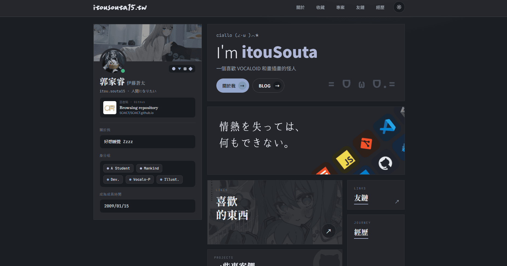

# itousouta.me

English | [繁體中文](README.zh.md)


Personal website of itouSouta / 郭家睿 / 伊藤蒼太, live at [itousouta.me](https://itousouta.me).

## Stack

| Layer | Technology |
|---|---|
| Framework | Next.js 14 (App Router) |
| Language | TypeScript |
| Styling | Plain CSS (single global stylesheet, CSS custom properties) |
| Data | Vercel KV (Redis) — Discord-sourced posts; Threads API — synced posts; GitHub API — repository info; Last.fm API — top albums |
| Real-time | [Lanyard API](https://github.com/Phineas/lanyard) — Discord presence |
| Deployment | Vercel |

No UI library, no CSS-in-JS, no component framework.

## Pages

| Route | Description |
|---|---|
| `/` | Home — profile card, hero, tech tiles, bento nav grid, GitHub contribution graph |
| `/about` | About — bio, stats, motto, and two Last.fm/likes teaser cards (top anime, top album) |
| `/thoughts` | 雜談 — feed merging Discord slash-command posts, synced Threads posts, and GitHub events |
| `/likes` | Likes — searchable, tag-filtered grid of novels, manga, and anime; Last.fm top-albums preview row |
| `/likes/[category]` | Category detail — full list with carousel and filter |
| `/likes/music` | Music — searchable grid of Last.fm top albums (square covers), same modal detail view as other categories |
| `/projects` | Projects — filterable card grid of personal projects with GitHub repository info |
| `/links` | Friends — link cards for friends and communities |
| `/experience` | Journey — timeline of experience and activities |
| `/feed.xml` | RSS feed — unified feed of thoughts, projects, and updates |
| (Cmd/Ctrl+K) | Command Palette — quick navigation and search for pages and projects |

## Features

**Theme**
Dark and light modes. The selected theme is persisted to `localStorage` and applied via a blocking inline script before first paint, preventing a flash of unstyled content.

**Typography**
Multiple typefaces are loaded from Google Fonts and the [emfont](https://font.emtech.cc) CDN:

- `ChenYuLuoYan` (emfont) — header logo
- `LXGWHeartSerif` (emfont) — quote display text
- `Shippori Mincho` / `Noto Serif TC` (Google Fonts) — headings and serif content
- `Dancing Script` (Google Fonts) — decorative script accents
- `JetBrains Mono` (Google Fonts) — monospace labels, kickers, code-like elements
- `Noto Sans TC` (Google Fonts) — body text

The logo is hidden until `ChenYuLuoYan` is active (detected via `document.fonts.load`) to prevent a FOUT caused by the fallback font rendering at a significantly larger apparent size.

**雜談 (Thoughts)**
A standalone Discord bot ([itouBot](../itouBot)) backs a `/碎碎念` slash command and writes entries to Vercel KV; after each post it pings `app/api/revalidate/route.ts` (guarded by `REVALIDATE_SECRET`) so the page updates immediately. The `/thoughts` page merges these entries with posts pulled from the Threads API (`app/lib/threads.ts`), sorted newest-first by timestamp. If no remote data is available, it falls back to the static `THOUGHTS` array in `app/data.ts`.

**Likes**
Novels, manga, anime, and VTuber entries are statically defined in `app/data.ts`. The likes pages support client-side full-text search and multi-tag filtering without any server dependency. Horizontal carousels use custom hooks for mouse-wheel and scroll-linked panning. `LikeCard`/`LikeFilterGrid` support a `layout` prop (`"circle"` for VTuber avatars, `"square"` for album covers) that swaps the thumbnail crop and, for `"circle"`, hides the sub-line and skips the detail modal in favor of linking straight out.

**Music (Last.fm)**
Unlike the rest of the likes content, music is live data: `app/lib/lastfm.ts` calls Last.fm's `user.gettopalbums` (album art is the only Last.fm entity that still returns real cover images — the artist/track endpoints now return one shared placeholder). It backs three surfaces at increasing scope: the about-page mini card (this month, top 4), the `/likes` preview row (overall, top 12), and the full `/likes/music` grid (overall, top 50). Every call site treats a `null` result (missing `LASTFM_API_KEY`/`LASTFM_USER`, or the API failing) as "no data" and degrades gracefully — the about-page card falls back to the static `MUSIC_ARTISTS` avatars in `app/data.ts`, and `/likes` simply omits the preview row.

**Lanyard integration**
Discord presence (online status, activity, Spotify playback) is fetched live from the Lanyard WebSocket API and displayed in the profile card. The component gracefully handles disconnection.

**GitHub contribution graph**
The graph SVG is pre-generated and committed as a static asset in both dark and light variants. On mobile, the card scrolls horizontally; the scroll position is linked to the card's progress through the viewport via `useScrollLinkedHorizontalReveal`, so the graph pans left to right as the user scrolls down the page — the reveal is remapped to a narrower window of that scroll distance (`TRIGGER_RANGE` in the hook) rather than the full enter-to-exit transit, so it doesn't take a full screen-height of scrolling to complete.

**Image thumbnails**
Avatars, likes covers, music art, and project screenshots are hotlinked from dozens of external, uncontrolled domains — too many to allowlist individually via `next/image`'s `remotePatterns`. `app/lib/imageThumb.ts` routes any `http(s)` source through the [wsrv.nl](https://wsrv.nl) resize proxy at the size actually needed for display (`avatarThumb`, `likeThumb`, `likeCircleThumb`, `artistAvatarThumb`, `songThumb`, `projectCoverThumb`, `cardBgThumb`), falling back to the original URL for local `/assets` paths, animated `.gif`s (the proxy's webp conversion drops animation), and the handful of domains in `PROXY_BLOCKED_HOSTS` that reject requests from the proxy.

**Animations**
- CSS keyframe marquee for the footer strip and tech tile rows
- Name rotator cycling through display names in the hero
- Page transitions via `PageTransition`
- Card hover effects (disabled on touch devices via `@media (hover: none)`)
- All animations respect `prefers-reduced-motion`

**Command Palette**
Quick site navigation and search via Cmd/Ctrl+K. Provides instant access to all pages and projects, with fuzzy search support for fast discovery.

**RSS Feed**
Unified RSS feed at `/feed.xml` merges thoughts from Discord (`/碎碎念` slash command), Threads posts, and GitHub repository events, sorted by timestamp.

**Projects and Details**
Projects page supports filtering by technology and category. Project cards fetch live repository information from GitHub API (stars, language, description). Clicking a project opens a modal with detailed information and a direct link.

**Likes Details**
Likes support detailed view with expanded descriptions and additional metadata beyond the grid card format.

**Accessibility and UX**
- Touch devices: hover transforms are reset; `:active` states provide tap feedback instead
- Back-to-top button with smooth scroll, visible after 400 px scrolled
- Mobile nav: Escape key closes the overlay; `tabIndex` is managed on hidden controls
- Horizontal scroll containers show a right-edge fade to indicate additional content

## Project structure

```
app/
  api/
    revalidate/route.ts              Secret-guarded revalidation hook (called by itouBot after each post)
  components/
    Header.tsx                       Sticky nav with mobile overlay
    Footer.tsx                       Footer with sitemap, projects, social links
    CommandPalette.tsx               Command palette trigger and state management
    CommandPaletteInner.tsx          Command palette UI and search logic (client-side)
    TileIcon.tsx                     Theme-aware technology icon tile (client component)
    tileIconMeta.ts                  Icon metadata (src, dark bg, light bg) — server-safe
    LanyardCards.tsx                 Discord presence components
    GithubContributionCard.tsx
    GithubGlyph.tsx                  Inline GitHub mark (SVGProps passthrough)
    LikeCard.tsx                     Supports default / "circle" (VTuber) / "square" (album) layouts
    LikeCategorySection.tsx          Category section with lazy-loading observer
    LikeDetailBody.tsx               Expanded like detail view (used in the modal)
    LikeFilterGrid.tsx               Search + tag filter + grid + modal wiring
    LikeModalShell.tsx               Portal-based modal shell for like details
    MusicSection.tsx                 Last.fm top-albums preview row (renders LikeCard, layout="square")
    ProjectDetailBody.tsx            Detailed project view with GitHub repository info
    ProjectFilterGrid.tsx            Filterable project grid with modal support
    ProjectModalShell.tsx            Portal-based modal shell for project details
    PageHead.tsx
    PageTransition.tsx
    BackToTopButton.tsx
    ThemeProvider.tsx
    SiteLoader.tsx                   Full-page loader with blur and transition effects
  hooks/
    useHorizontalWheelScroll.ts          Mouse-wheel horizontal pan
    useScrollLinkedHorizontalReveal.ts   Scroll-position-linked horizontal pan
  lib/
    kv.ts                             Vercel KV read/write for Discord-sourced thoughts
    threads.ts                        Threads API fetch for synced posts
    github.ts                         GitHub API fetch for repository info and events
    lastfm.ts                         Last.fm API fetch for top albums (about/likes/music)
    imageThumb.ts                     wsrv.nl resize-proxy helpers for external images
    sortLikes.ts                      Rating-based sort (rating → personRating, unrated sinks last)
    ratingStars.tsx                   5-star rating renderer (dim track + clipped fill overlay)
    mergedThoughts.ts                 Merge and deduplicate thoughts from multiple sources
  about/page.tsx
  experience/page.tsx
  likes/page.tsx
  likes/[category]/page.tsx
  likes/music/page.tsx
  links/page.tsx
  projects/page.tsx
  thoughts/page.tsx
  feed.xml/route.ts                 RSS feed route (merged thoughts + projects)
  robots.ts           robots.txt route
  sitemap.ts          Sitemap route (includes per-category likes URLs)
  page.tsx            Home
  layout.tsx          Root layout — fonts, theme script, header, footer, command palette
  globals.css         All styles
  data.ts             All content — roles, likes, projects, music fallback, links, fallback thoughts
public/
  assets/             Images and GitHub contribution SVGs
  icon/               Custom SVG icons
scripts/
  cleanup-thoughts.mjs     Remove KV thought entries matching a given text
```

## Development

Node 20 or later is required.

```bash
npm install
npm run dev      # http://localhost:3000
npm run build
npm run start
npm run lint
```

### Environment variables

Required for the `/thoughts` page (see `.env.local`):

| Variable | Purpose |
|---|---|
| `REVALIDATE_SECRET` | Shared secret for `app/api/revalidate/route.ts` (itouBot uses the same value) |
| `KV_REST_API_URL`, `KV_REST_API_TOKEN`, `KV_REST_API_READ_ONLY_TOKEN`, `KV_URL`, `REDIS_URL` | Vercel KV connection |
| `THREADS_ACCESS_TOKEN` | Fetching synced posts from the Threads API |
| `GITHUB_TOKEN` | GitHub API access for fetching repository information (optional; without it, repository details are unavailable) |
| `LASTFM_API_KEY`, `LASTFM_USER` | Fetching top albums for the about page, `/likes`, and `/likes/music` (optional; see below if unset) |

Spotify's Web API now requires a Premium account to register a new developer app, so the music integration goes through Last.fm instead — a free, instant-approval API key, with Spotify plays scrobbled to it. Without `LASTFM_API_KEY`/`LASTFM_USER` (or if the account has no scrobbles yet), `getTopAlbums()` returns `null` and each call site falls back accordingly: the about-page card shows the static `MUSIC_ARTISTS` avatars, and the `/likes` preview row is simply omitted.


## Deployment

Deployed on Vercel; pushes to `main` trigger a new production deployment. The custom domain is configured in the Vercel project (the `CNAME` file is a legacy artifact from a prior GitHub Pages setup). Discord slash commands are handled by the standalone [itouBot](../itouBot) process, which shares the same Vercel KV store and calls `/api/revalidate` after each post.

## Content

Most page content lives in `app/data.ts`. To add or update a like, project, or friend link, edit the relevant exported array and push. No configuration changes are needed.

雜談 content comes from two live sources instead: Discord (`/碎碎念` slash command → KV) and Threads (synced automatically). The `THOUGHTS` array in `app/data.ts` is only a fallback shown when neither remote source returns data.

Music is likewise live (Last.fm top albums, see [Environment variables](#environment-variables)); the `MUSIC_ARTISTS` array in `app/data.ts` is only a fallback for the about-page card, shown when Last.fm isn't configured or returns nothing. To change which album/background image the about-page mini cards feature, edit the `INTEREST_BG` / `MUSIC_BG` constants near the top of `app/about/page.tsx`.

Technology icons are defined in `app/components/tileIconMeta.ts`. Each entry has a label, a Devicons CDN URL, a dark-mode background colour, and a light-mode background colour.
