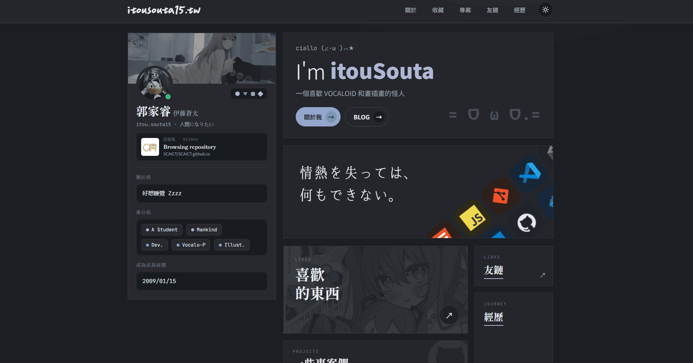

# itouSouta.me

[English](README.md) | 繁體中文



itouSouta / 郭家睿 / 伊藤蒼太 的個人網站，網址為 [itousouta.me](https://itousouta.me)。

這是一個高度客製化的個人網站，圍繞個人檔案、專案、雜談、喜好媒體、音樂、朋友連結，以及一些好玩的互動彩蛋展開。目標不是做成一套通用範本，而是一個帶著即時資料與強烈視覺個性的小型個人網路空間。

## 功能特色

- 首頁採個人檔案風格，含 Discord 即時狀態、主題感知視覺效果與專案導覽。
- 雜談動態牆整合 Discord 貼文、Threads 貼文與 GitHub 事件三種來源。
- 小說、漫畫、動畫、VTuber 喜好清單，以及由 Spotify 驅動的音樂資料。
- 專案展示牆，支援篩選、模態詳情與 GitHub 專案資訊。
- 每一頁底部都有 KV 儲存的留言板，支援串接回覆、選填的「用 GitHub 登入」，以及有人回覆你的留言時透過 Resend 寄出的通知信。
- `/writing` 文章的按讚計數。
- 朋友連結、經歷時間軸、RSS Feed、sitemap 與 robots 路由。
- 深色／淺色主題，動畫皆遵循 `prefers-reduced-motion`。
- 透過 Cmd/Ctrl+K 快速導覽與搜尋。
- 由 Service Worker 預先快取首頁的離線備援頁面。
- 公開的 SVG 狀態徽章（最新文章標題、Discord 狀態、GitHub 星數總和），可以嵌到別的地方用。
- 每個路由各自的 Open Graph 分享圖，於建置期間產生，將品牌橫幅與頭像合成進去。

## 技術棧

| 層級     | 技術                                            |
| -------- | ----------------------------------------------- |
| 框架     | Next.js 14（App Router）                        |
| 語言     | TypeScript                                      |
| 樣式     | 純 CSS（CSS custom properties）                 |
| 資料     | Vercel KV、Threads API、GitHub API、Spotify API |
| 即時資料 | Lanyard API                                     |
| 郵件     | Resend（留言板回覆通知信）                      |
| 離線支援 | Service Worker（`public/sw.js`）                |
| 部署     | Vercel                                          |

沒有使用 UI 函式庫、CSS-in-JS，也沒有使用元件框架。

## 架構

大部分內容位於 [app/data.ts](app/data.ts)。網站頁面本身盡量維持靜態，再依需要疊上即時資料：

- `/writing` 整合部落格索引、KV 雜談、Threads 貼文與 GitHub 動態。
- `/likes/music` 在有憑證時讀取 Spotify 常聽歌曲。
- 「正在播放」指示器（`/api/now-playing`、個人檔案卡、底部浮動列）直接呼叫 Spotify API，而非依賴 Discord 轉發的狀態，因此手機上即使沒開 Discord app 也能顯示；只有在沒有設定 Spotify 憑證時才會退回 Lanyard。
- `/api/vtuber-live` 檢查 VTuber 開台狀態，結果短時間快取。
- 留言板（`/api/guestbook`，顯示在每一頁底部）直接讀寫 Vercel KV，取代了先前透過代理連到部落格留言伺服器的做法。回覆採串接式，若被回覆者留了 email（或用 GitHub 登入並授權了 `user:email` scope），會觸發一封 Resend 通知信。
- `/api/reactions` 提供 `/writing` 文章的按讚計數。
- `public/sw.js` 預先快取 `/` 與 `/offline`，做最基本的離線備援；只在正式環境註冊，因為開發模式下 Next 每次重建都會換 chunk 檔名，stale-while-revalidate 的 Service Worker 反而會讓頁面卡死。
- `/api/badge/*` 產生 shields.io 風格的 SVG（最新文章標題、Discord 狀態、GitHub 星數總和），可以嵌到其他 README 或頁面。
- 專案卡片在可取得時使用 GitHub API 資料，否則優雅降級。
- 本機圖片依用途分類於 `public/assets/brand`、`public/assets/projects`、`public/assets/likes`、`public/assets/social`。

更深入的筆記見 [docs/architecture.md](docs/architecture.md)（英文）。

## SEO 與分享圖

每頁的 metadata 都由 [app/lib/seo.ts](app/lib/seo.ts) 的 `pageMetadata({ title, description, path })` 統一產生。這是刻意集中管理的：Next.js 的 metadata 只有最外層欄位會沿著 layout → page 合併，`openGraph`、`twitter` 這類巢狀物件則是**整包覆蓋**。若每頁各自宣告，會悄悄砍掉 root layout 設好的 `og:site_name`、`og:locale`，並讓 `twitter:card` 從 `summary_large_image` 掉回 `summary`。同理，root layout 刻意不設 `alternates.canonical`——那樣會被繼承下去，任何忘記自己覆蓋的頁面都會宣告首頁是自己的正規網址。

Open Graph 圖片由 [app/lib/ogImage.tsx](app/lib/ogImage.tsx) 的 `renderOg()` 產生——1200×630，以 `banner.webp` 當半透明底圖，蓋一層由左到右的漸層遮罩，右側放頭像。這些路由刻意不設 `runtime`，因此會在 `next build` 期間預先產成靜態 PNG（沒有 serverless function，`resvg.wasm` 也不會進 bundle）。

兩個踩過的坑：

- **改了 `ogImage.tsx` 的版面後，記得把十個 `opengraph-image.tsx` 檔案開頭的日期註解一起 bump。** `og:image` 網址後面的 `?hash` 是對「該路由檔自己的原始碼」算的 content hash，不含它 import 的內容或渲染出的 PNG。只改共用的 renderer，網址會維持不變——而回應標頭是 `immutable, max-age=31536000`，Discord、X 會永遠顯示舊卡片。
- `public/assets/brand/` 底下的檔案雖然副檔名是 `.webp`，**其實是 PNG**。satori 認 magic bytes 不認副檔名，只支援 `[png, apng, jpeg, gif, svg]`；真的丟 WebP 進去會丟出 `Unsupported image type`。

中文字型透過 Google Fonts 逐張子集化（見 [app/lib/ogFont.ts](app/lib/ogFont.ts)）；抓取失敗時會降級為純拉丁字的卡片，不會讓 build 失敗。

## 開發

需要 Node 20 或以上版本。

```bash
npm install
npm run dev      # http://localhost:3000
npm run build
npm run start
npm run lint
```

### 環境變數

依你想啟用哪些即時功能，以下變數為必要或選填：

| 變數                                                                                         | 用途                                                                                                                                             |
| -------------------------------------------------------------------------------------------- | ------------------------------------------------------------------------------------------------------------------------------------------------ |
| `REVALIDATE_SECRET`                                                                          | itouBot 呼叫的重新驗證端點所使用的共用密鑰                                                                                                       |
| `KV_REST_API_URL`、`KV_REST_API_TOKEN`、`KV_REST_API_READ_ONLY_TOKEN`、`KV_URL`、`REDIS_URL` | Vercel KV 連線設定                                                                                                                               |
| `THREADS_ACCESS_TOKEN`                                                                       | 擷取同步的 Threads 貼文                                                                                                                          |
| `GITHUB_TOKEN`                                                                               | 擷取 GitHub 專案資訊與動態                                                                                                                       |
| `SPOTIFY_CLIENT_ID`、`SPOTIFY_CLIENT_SECRET`、`SPOTIFY_REFRESH_TOKEN`                        | 擷取 Spotify 常聽歌曲與目前播放曲目（見 `scripts/spotify-refresh-token.mjs`；scope 含 `user-read-currently-playing`，較舊的 token 需要重新授權） |
| `GITHUB_OAUTH_CLIENT_ID`、`GITHUB_OAUTH_CLIENT_SECRET`、`GUESTBOOK_GH_SECRET`                | 留言板的「用 GitHub 登入」（OAuth App callback：`/api/auth/github/callback`；`GUESTBOOK_GH_SECRET` 用來簽署短效身分 token）                      |
| `RESEND_API_KEY`、`RESEND_FROM`                                                              | 留言板回覆通知信（Resend；需在 Resend 後台驗證寄件網域，例如 `RESEND_FROM="itousouta.me <no-reply@itousouta.me>"`）                              |

缺少選填憑證時網站會優雅降級，對應區塊會退回備援資料或直接不顯示，而不會整個壞掉。

## 文件

- [Architecture](docs/architecture.md)（英文）
- [VTuber Live Status](docs/vtuber-live.md)（英文）
- [Easter Eggs](docs/easter-eggs.md)（英文）

## 部署

網站部署於 Vercel；推送至 `main` 分支會觸發正式環境部署。

GitHub 貢獻圖 SVG 由 [.github/workflows/snake.yml](.github/workflows/snake.yml) 每日重新產生並寫入 `public/assets/social/`。

## 授權條款

本專案採用 Apache License 2.0 授權，詳見 [LICENSE](LICENSE)。
